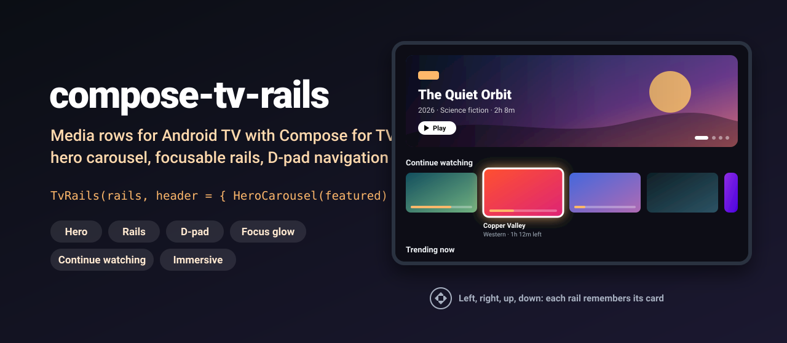
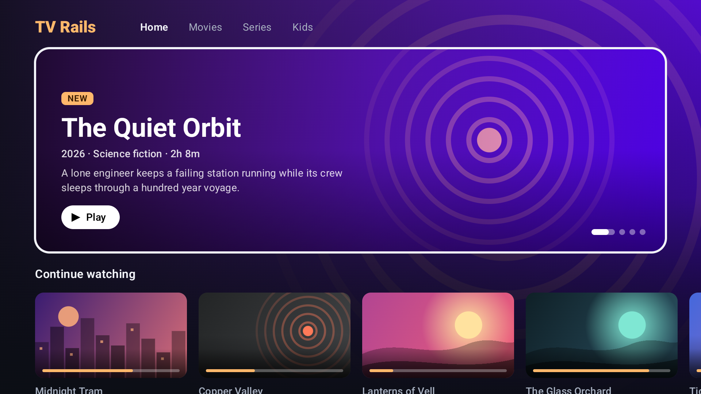
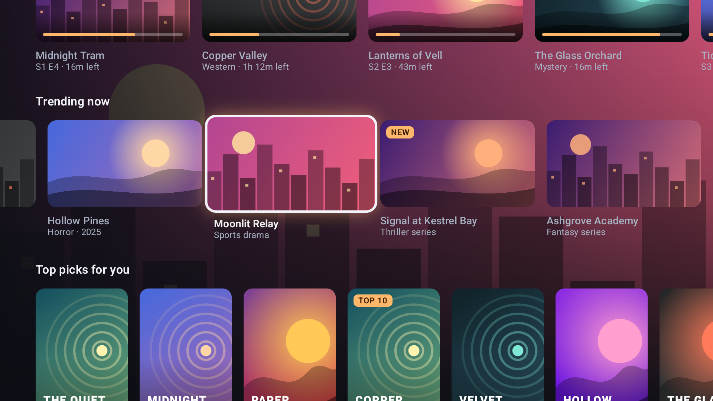
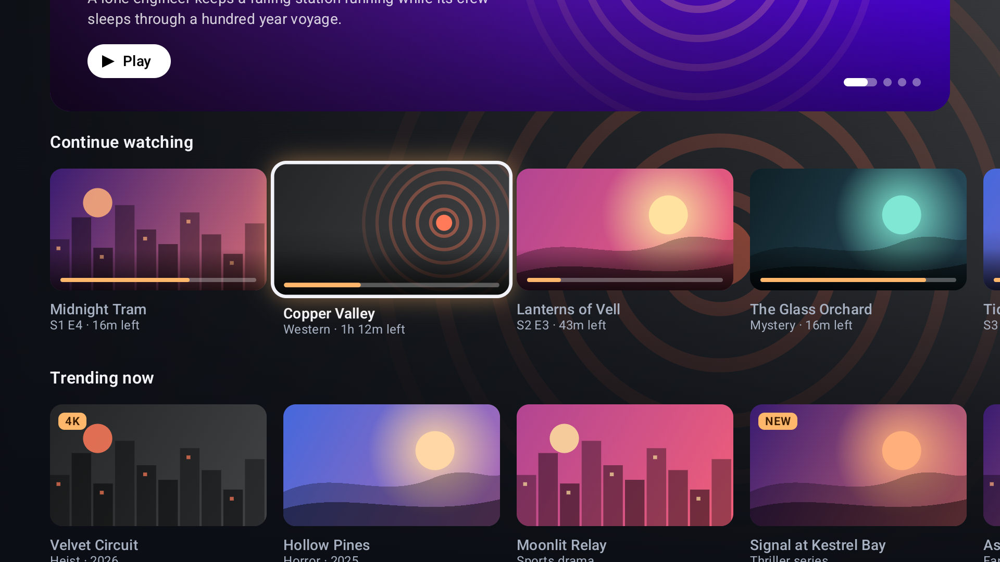

<p align="center">
  
</p>

<p align="center">
  <a href="https://github.com/halilozel1903/compose-tv-rails/actions/workflows/ci.yml"></a>
  <a href="https://jitpack.io/#halilozel1903/compose-tv-rails"></a>
  
  
  
  
  <a href="LICENSE"></a>
</p>

**compose-tv-rails** gives you the home screen of a streaming app for Android TV, built with Compose for TV: a hero carousel that advances on its own, horizontal rails of focusable cards that scale up and glow under the D-pad, continue watching cards with progress, and an immersive backdrop that fades to whatever is focused. Each rail remembers its focused card, so up and down bring you back where you were. The focus and carousel logic lives in a plain Kotlin module with unit tests.

```kotlin
val railsState = rememberTvRailsState()

ImmersiveBackground(targetState = railsState.focusedItem(rails) ?: featured.first(), backdrop = { Backdrop(it) }) {
    TvRails(
        rails = rails,
        state = railsState,
        header = { HeroCarousel(featured, Modifier.height(280.dp), artwork = { Backdrop(it) }) },
        artwork = { item -> Poster(item) },
        onItemClick = { item -> play(item) },
    )
}
```

## Screenshots

Captured from the sample app on an Android TV emulator (1080p) by CI.

| Home with the hero focused | A focused card in a rail | Continue watching |
| :---: | :---: | :---: |
|  |  |  |

## Why

Compose for TV gives you focusable `Card` and `Surface` components, but a home screen needs more than that. A lazy rail that scrolled off screen forgets which card was focused, so coming back lands on a random one. A carousel needs a timer that pauses, restarts after a manual move and can be saved. Continue watching needs progress math and "32m left" texts. And the backdrop should follow focus without flicker. compose-tv-rails wires this together and keeps the logic in `compose-tv-rails-core`, a pure Kotlin module with 38 unit tests.

## Features

- **`HeroCarousel(items)`**: a large focusable banner that cross fades between featured titles every 7 seconds (configurable), with a progress pill in the dot indicator. D-pad `Right` and `Left` change slides, center plays. It can pause while focused, loop or stop at the end, and it survives process death.
- **`MediaRail(rail)`**: a section title and a `LazyRow` of cards. A focus restorer brings focus back to the last focused card, and the rail's scroll position and memory live in `TvRailsState`, so this also works after the rail was disposed by the outer list.
- **`TvRails(rails, header)`**: the whole screen, a `LazyColumn` of rails with an optional header (usually the hero).
- **Focus animations**: cards use tv-material `Card` with a 1.1x focused scale, a colored glow and a border; the title below brightens.
- **`ContinueWatchingCard`**: a progress bar over the artwork and `"Copper Valley · 1h 12m left"` below it. `Rail.continueWatching(...)` keeps only titles that are started and not finished.
- **Three card styles**: `RailStyle.Poster` (2:3), `Landscape` (16:9) and `ContinueWatching`.
- **`ImmersiveBackground(targetState)`**: a full screen backdrop that cross fades to the focused item, with left and bottom scrims so text stays readable.
- **D-pad rules** with `NavigationRules`: wrap around inside a rail, wrap from the last rail to the first, and per rail column memory (or keep the column, like a grid). Empty rails are skipped.
- **Programmatic focus**: `railsState.requestFocus(row, column)` scrolls to a card and focuses it, for deep links or returning from the player. `rememberTvRailsState(initialFocus = ...)` does it on start.
- **Bring your own images**: every component takes an `artwork` slot, so Coil, Glide, resources or drawn placeholders all work. No image library is pulled in.
- **Pure Kotlin core** (`compose-tv-rails-core`): `RailItem`, `Rail`, `RailNavigator`, `CarouselTimeline`, `WatchProgress` and `TimeFormat`, unit tested.

## Installation

Add JitPack to `settings.gradle.kts`:

```kotlin
dependencyResolutionManagement {
    repositories {
        google()
        mavenCentral()
        maven("https://jitpack.io")
    }
}
```

Then the dependency:

```kotlin
dependencies {
    implementation("com.github.halilozel1903.compose-tv-rails:compose-tv-rails:1.0.0")
    // Pure Kotlin models, focus navigation and carousel timing only (for JVM/KMP modules):
    // implementation("com.github.halilozel1903.compose-tv-rails:compose-tv-rails-core:1.0.0")
}
```

The library brings `androidx.tv:tv-material` 1.1.0 as an `api` dependency. Your app's manifest should declare it runs on TV:

```xml
<uses-feature android:name="android.software.leanback" android:required="false" />
<uses-feature android:name="android.hardware.touchscreen" android:required="false" />

<application android:banner="@drawable/banner" ...>
    <activity android:name=".MainActivity" android:exported="true">
        <intent-filter>
            <action android:name="android.intent.action.MAIN" />
            <category android:name="android.intent.category.LEANBACK_LAUNCHER" />
        </intent-filter>
    </activity>
</application>
```

> The build is also set up for Maven Central (`io.github.halilozel1903:compose-tv-rails`) via the vanniktech publish plugin.

## Quick start

**Describe your content**

```kotlin
val rails = listOf(
    Rail.continueWatching("continue", "Continue watching", history),   // only started, unfinished titles
    Rail(
        id = "trending",
        title = "Trending now",
        items = trending.map { RailItem(id = it.id, title = it.name, subtitle = it.genre, durationMillis = it.length) },
    ),
    Rail("picks", "Top picks for you", picks, style = RailStyle.Poster),
)
```

`RailItem` has an `id`, `title`, `subtitle`, `description`, `durationMillis`, `positionMillis` (for progress) and an optional `badge` such as `"NEW"` or `"4K"`. Ids must be unique inside a rail.

**The home screen**

```kotlin
@Composable
fun HomeScreen(rails: List<Rail>, featured: List<RailItem>, onPlay: (RailItem) -> Unit) {
    val railsState = rememberTvRailsState()
    val heroState = rememberHeroCarouselState(itemCount = featured.size, intervalMillis = 8_000)

    ImmersiveBackground(
        targetState = railsState.focusedItem(rails) ?: featured[heroState.currentIndex],
        modifier = Modifier.fillMaxSize(),
        backdrop = { item -> AsyncImage(item.backdropUrl, null, Modifier.fillMaxSize(), contentScale = ContentScale.Crop) },
    ) {
        TvRails(
            rails = rails,
            state = railsState,
            onItemClick = onPlay,
            header = {
                HeroCarousel(
                    items = featured,
                    state = heroState,
                    modifier = Modifier.padding(horizontal = 48.dp).fillMaxWidth().height(280.dp),
                    onItemClick = onPlay,
                    pauseWhenFocused = false,
                    artwork = { item -> AsyncImage(item.backdropUrl, null, Modifier.fillMaxSize(), contentScale = ContentScale.Crop) },
                )
            },
            artwork = { item -> AsyncImage(item.posterUrl, item.title, Modifier.fillMaxSize(), contentScale = ContentScale.Crop) },
        )
    }
}
```

(`AsyncImage` is Coil; `backdropUrl` and `posterUrl` stand for your own lookups by `item.id`.)

**Single pieces**

```kotlin
MediaRail(rail, state = railsState, rowIndex = 0, onItemClick = onPlay, artwork = { Poster(it) })

MediaCard(item, onClick = { onPlay(item) }, style = RailStyle.Poster) { Poster(it) }

ContinueWatchingCard(item, onClick = { resume(item) }) { Thumbnail(it) }

SectionTitle("Because you watched Paper Mountains", trailing = "12 titles")
```

**D-pad rules and focus**

```kotlin
val railsState = rememberTvRailsState(
    initialFocus = FocusPosition(row = 1, column = 0),              // focus a card on start
    rules = NavigationRules(wrapColumns = true, rememberColumns = true),
)

LaunchedEffect(returnedFromPlayer) { railsState.requestFocus(row = 0, column = 0) }
```

**Hero content**

The default slide shows the badge, title, subtitle with the duration, description and a play hint. Replace it with `content`:

```kotlin
HeroCarousel(featured, artwork = { Backdrop(it) }) { item ->
    HeroCarouselDefaults.Content(item, actionLabel = stringResource(R.string.watch_now))
}
```

## API

| `TvRailsState` | What it does |
| --- | --- |
| `focusedPosition` / `focusedItem(rails)` | The focused card, `null` while focus is outside the rails (for example on the hero) |
| `lastFocusedItem(rails)` | The last focused card, even after focus moved away |
| `rememberedColumn(row)` | The card a rail returns to |
| `requestFocus(row, column)` | Scrolls to a card and focuses it |
| `rules` | `NavigationRules(wrapColumns, wrapRows, rememberColumns)` |

| `HeroCarouselState` | What it does |
| --- | --- |
| `currentIndex`, `itemCount` | The slide on screen |
| `next()`, `previous()`, `jumpTo(index)` | Manual moves; they restart the slide's timer |
| `pause()`, `resume()`, `isPaused` | Hold auto-advance |
| `progress` | The current slide's interval in `0..1`, for your own indicator |

| Core | What it does |
| --- | --- |
| `RailNavigator(rowSizes, rules).move(state, NavDirection.Down)` | Returns `MoveResult.Moved(state)` or `MoveResult.Edge(direction)` when focus should leave the rails |
| `CarouselTimeline(itemCount, intervalMillis).advanceBy(delta)` | The carousel clock as an immutable value |
| `WatchProgress.fraction / isInProgress / isFinished` | Progress math with a 95% finished threshold |
| `TimeFormat.duration / remaining / clock / episode / joinMeta` | `"1h 42m"`, `"32m left"`, `"1:02:03"`, `"S2 E5"`, `"2026 · Drama"` with translatable `Labels` |

`TvRailsDefaults` holds the sizes (poster 124 dp, landscape 208 dp, 48 dp safe area), the focused scale and the fade durations.

## How it works

```text
D-pad Right/Left   -> platform focus search inside the LazyRow; with wrapColumns the rail asks
                      RailNavigator and jumps to the other end itself
D-pad Up/Down      -> the next rail's focusRestorer restores its last card; after disposal the
                      fallback is the card TvRailsState remembers for that row
card focused       -> TvRailsState.onItemFocused(row, column) -> focusedItem -> ImmersiveBackground cross fades
hero               -> withFrameMillis ticks CarouselTimeline.advanceBy(delta); Left/Right call previous()/next()
```

```kotlin
val nav = RailNavigator(rowSizes = listOf(10, 3), rules = NavigationRules())
val down = nav.move(RailFocusState(row = 0, column = 8), NavDirection.Down) // Moved: row 1, column 0 (never visited)
val edge = nav.move(RailFocusState(row = 0, column = 0), NavDirection.Up)   // Edge(Up): move focus to the hero
```

## Sample app

The `sample` module is an Android TV app (it also installs on phones) with a hero of four featured titles and four rails: continue watching, trending, poster picks and new releases. All titles are made up and all artwork is drawn with Compose (gradients, simple shapes and text), so there are no image assets and no network.

D-pad presses can't be timed reliably through adb on a fresh emulator, so the sample sets up screenshot scenes from an intent extra (used by `scripts/screenshots.sh`):

```bash
./gradlew :sample:installDebug
adb shell am start -n io.github.halilozel1903.tvrails.sample/.MainActivity --es scene focused-rail
```

`scene` is one of `home` (the hero focused), `focused-rail` (the third card of "Trending now") or `continue` (the second continue watching card).

## Project structure

| Module | What it is |
| --- | --- |
| `tvrails-core` | Pure Kotlin: models, D-pad navigation with focus memory, carousel timeline, progress and time formatting. Published as `compose-tv-rails-core` |
| `tvrails` | Compose for TV: `TvRails`, `MediaRail`, `MediaCard`, `ContinueWatchingCard`, `HeroCarousel`, `ImmersiveBackground`, `SectionTitle`. Published as `compose-tv-rails` |
| `sample` | An Android TV home screen with generated artwork and screenshot scenes |

## Tech stack

Kotlin 2.4 · AGP 9.4 with built-in Kotlin · Gradle 9.6 · Jetpack Compose (BOM 2026.09) · Compose for TV (`androidx.tv:tv-material` 1.1.0) · Focus restorer and key events · Compose animation · GitHub Actions with an Android TV emulator

## License

MIT. See [LICENSE](LICENSE).
